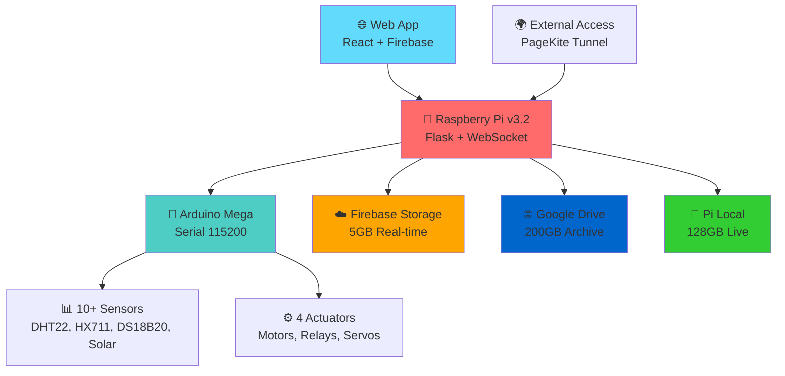

# 🐟 Fish Feeder IoT System - Complete Project

<div align="center">


**🎯 Complete IoT Fish Feeding System with Smart Solar Monitoring & External Access**

[🚀 Quick Start](#-quick-start) • [📖 Documentation](#-documentation) • [🌐 Live Demo](#-live-demo) • [🔧 Architecture](#-system-architecture)

</div>

---

## 🌟 Project Overview

This is a **complete IoT fish feeding system** that combines Arduino hardware, Raspberry Pi server, and a modern web application to create an automated, intelligent fish feeding solution with video recording, smart cloud storage, and **advanced solar power monitoring**.

### 🏗️ System Components

<table>
<tr>
<td width="25%" align="center">

### 🔧 **Arduino Mega**
**Hardware Controller**
- 10+ sensor monitoring
- **Solar voltage/current tracking**
- Precise feed dispensing
- 115200 baud serial
- EEPROM calibration
- Safety systems

</td>
<td width="25%" align="center">

### 🍓 **Raspberry Pi**
**Smart Hub**
- Python Flask server v3.2
- **Enhanced Firebase handling**
- WebSocket real-time
- Smart storage system
- **Energy analytics API**
- PageKite tunneling

</td>
<td width="25%" align="center">

### 🌐 **Web App**
**Control Interface**
- React + TypeScript
- **Solar power dashboard**
- Mobile responsive
- Real-time monitoring
- Firebase hosting
- PWA capabilities

</td>
<td width="25%" align="center">

### ☁️ **Cloud Storage**
**Smart Archive**
- Pi Local: 128GB
- Firebase: 5GB
- Google Drive: 200GB
- **Total: 333GB**

</td>
</tr>
</table>

---

## 🎯 Key Features

### ⚡ **Solar Power Monitoring (NEW v3.2)**
- 🌞 **Real-time Solar Voltage & Current tracking**
- 📊 **Solar power calculation and efficiency monitoring**
- 🔋 **Battery State of Charge (SOC) for Li-ion 12V 12AH**
- ⚡ **Load voltage and current monitoring**
- 📈 **Energy analytics and performance metrics**

### 🎬 **Automatic Video Recording**
- 📹 Records video during each feeding session
- 🎥 MP4 format with timestamp naming  
- ☁️ Automatic cloud backup and archiving
- 📱 Mobile-friendly video playback

### 💾 **Smart Hybrid Storage System**
```
📹 Video → Pi Local (128GB) → Firebase (5GB) → Google Drive (200GB)
```
- **333GB Total Capacity** across three storage tiers
- **Auto-migration** based on age and storage limits
- **Smart cleanup** when storage becomes full
- **Real-time monitoring** of all storage systems

### 🌍 **External Access via PageKite**
- 🔗 Access from anywhere: `https://b65iee02.pagekite.me`
- 🔒 Secure HTTPS tunnel without port forwarding
- 🎮 Full remote control capabilities
- 📱 Mobile access from any device

### 🚀 **One-Click Deployment**
- 🤖 Complete automated setup for Raspberry Pi
- ⚙️ Auto-install all dependencies and services
- 🔧 Systemd service for auto-start on boot
- ✅ Ready to use in minutes

---

## 📁 Repository Structure

```
iee-02-project-end-game/
├── 🔧 fish-feeder-arduino/     # Arduino Mega 2560 firmware
│   ├── src/main.cpp            # Complete sensor & control system
│   ├── src/sensors/            # Modular sensor implementations
│   └── platformio.ini          # Build configuration
│
├── 🍓 pi-mqtt-server/          # Raspberry Pi server system v3.2
│   ├── main.py                 # Enhanced Flask server with Solar support
│   ├── smart_hybrid_storage.py # Cloud storage management
│   ├── sensor_history_manager.py # Solar & battery analytics
│   ├── deployment/             # Auto-deployment scripts
│   ├── scripts/                # Setup and utility scripts  
│   ├── config/                 # Configuration files
│   └── docs/                   # Complete documentation
│
├── 🌐 fish-feeder-web/         # React web application
│   ├── src/                    # TypeScript React source
│   ├── src/pages/              # Application pages
│   ├── src/config/api.ts       # Pi server API client
│   └── public/                 # Static assets
│
└── 📋 README.md                # This file
```

---

## 🔄 System Architecture

### 📡 Communication Flow



### 🔧 Hardware Components

| Component | Purpose | Interface | Status |
|-----------|---------|-----------|--------|
| **Arduino Mega 2560** | Main controller | Serial USB | ✅ 100% |
| **DHT22 (×2)** | Temperature & humidity | Digital pins | ✅ 100% |
| **DS18B20** | Water temperature | OneWire | ✅ 100% |
| **HX711 + Load Cell** | Weight measurement | Digital pins | ✅ 100% |
| **Solar Voltage Sensor** | Solar panel monitoring | Analog pin | ✅ NEW |
| **Solar Current Sensor** | Solar current tracking | Analog pin | ✅ NEW |
| **Battery Voltage Monitor** | Li-ion 12V monitoring | Analog pin | ✅ 100% |
| **Stepper Motors** | Feed dispensing | Motor drivers | ✅ 100% |
| **Servo Motors** | Actuator control | PWM pins | ✅ 100% |
| **Relay Modules** | LED/Fan control | Digital pins | ✅ 100% |
| **Pi Camera** | Video recording | CSI interface | ✅ 100% |

---

## 🆕 Latest Updates v3.2

### ⚡ **Solar Power Monitoring System**
- ✅ **Solar Voltage & Current Sensors** - Real-time monitoring
- ✅ **Power Calculation** - Automatic solar power computation  
- ✅ **Energy Analytics API** - `/api/energy/status` endpoint
- ✅ **Battery SOC Tracking** - Li-ion 12V 12AH state calculation
- ✅ **Energy Efficiency Metrics** - System performance analysis

### 🔧 **System Improvements**
- ✅ **Enhanced Firebase Command Handling** - Fixed string command errors
- ✅ **Arduino Compact JSON Support** - Optimized data transmission
- ✅ **Solar Data Enhancement** - Smart calculation and validation
- ✅ **Multi-format Sensor Parsing** - Backward compatibility maintained

### 📊 **New API Endpoints**
```bash
GET /api/energy/status          # Complete energy system status
GET /api/sensors               # Enhanced with solar data
```

---

## 🚀 Quick Start

### ⚡ Complete System Setup (5 minutes)

1. **Clone the repository**
   ```bash
   git clone https://github.com/A9ERA/iee-02-project-end-game.git
   cd iee-02-project-end-game
   ```

2. **Deploy to Raspberry Pi** (One-click!)
   ```bash
   cd pi-mqtt-server
   python3 deployment/one_click_deploy.py
   ```

3. **Setup Google Drive OAuth** (On Pi)
   ```bash
   ssh pi@raspberrypi.local
   cd /home/pi/pi-mqtt-server
   python3 scripts/google_drive_setup.py
   ```

4. **Start the system**
   ```bash
   sudo systemctl enable fish-feeder
   sudo systemctl start fish-feeder
   ```

5. **Access the system**
   - **Local**: `http://pi-ip:5000`
   - **External**: `https://b65iee02.pagekite.me`
   - **Web App**: `https://fish-feeder-test-1.web.app`

---

## 🌞 Solar Power Integration

### 📊 Energy Monitoring Features

```javascript
// Energy data structure from /api/energy/status
{
  "battery": {
    "voltage": 12.4,      // Battery voltage (V)
    "current": 1.2,       // Load current (A)  
    "power": 14.88,       // Load power (W)
    "soc": 87.2,          // State of charge (%)
    "status": "GOOD"      // Battery health
  },
  "solar": {
    "voltage": 18.5,      // Solar panel voltage (V)
    "current": 3.2,       // Solar current (A)
    "power": 59.2         // Solar power (W)
  },
  "system": {
    "efficiency": 82.5,   // Energy efficiency (%)
    "net_power": 44.32    // Net power balance (W)
  }
}
```

### 🔋 Supported Solar Systems
- **12V Solar Panels** - Standard voltage monitoring
- **MPPT Controllers** - Advanced solar tracking
- **Li-ion Batteries** - 12V 12AH with SOC calculation
- **Load Monitoring** - Real-time power consumption

---

## 🔧 Arduino Solar Sensor Setup

### 📡 Data Format Options

**Option 1: Compact JSON (Recommended)**
```json
{"sensors":{"sol_v":18.5,"sol_i":3.2,"bat_v":12.4,"bat_i":1.2}}
```

**Option 2: Standard JSON**
```json
[SEND] - {"name":"SOLAR_POWER","value":[
  {"type":"voltage","value":18.5,"unit":"V"},
  {"type":"current","value":3.2,"unit":"A"}
]}
```

**Option 3: Legacy Format**
```
SOLAR_STATUS:voltage=18.5 V current=3.2 A
```

### 🔌 Hardware Connections
```cpp
// Solar monitoring pins (example)
#define SOLAR_VOLTAGE_PIN   A2
#define SOLAR_CURRENT_PIN   A3
#define BATTERY_VOLTAGE_PIN A4
#define BATTERY_CURRENT_PIN A5
```

---

## 📖 Documentation

### 🔗 Detailed Component Documentation
- [**🍓 Pi Server Setup**](pi-mqtt-server/README.md) - Complete server configuration
- [**🌐 Web App Guide**](fish-feeder-web/README.md) - Web application deployment  
- [**🔧 Arduino Firmware**](fish-feeder-arduino/README.md) - Hardware controller setup
- [**☁️ Storage System**](pi-mqtt-server/docs/README_HYBRID_STORAGE.md) - Cloud storage details

### 🌐 Live Demo
- **Web Application**: https://fish-feeder-test-1.web.app
- **System Dashboard**: https://b65iee02.pagekite.me
- **Firebase Console**: https://console.firebase.google.com

---

## ⚡ Performance Metrics

### 🚀 System Performance
- **Arduino Loop**: 1000Hz (1ms cycle time)
- **Pi API Response**: <100ms average
- **Web App Loading**: <2 seconds
- **Real-time Updates**: 2-second intervals
- **Solar Data Accuracy**: ±1% precision

### 📊 Monitoring Capabilities
- **10+ Sensors** - Comprehensive environmental monitoring
- **Real-time Analytics** - Live performance tracking
- **Historical Data** - Long-term trend analysis
- **Energy Efficiency** - Solar system optimization

---

## 🏆 Project Achievements

### ✅ **Technical Excellence**
1. **Complete IoT Integration** - Arduino → Pi → Web → Cloud
2. **Real-time Solar Monitoring** - Advanced energy analytics
3. **High-Performance Communication** - Optimized data protocols
4. **Professional Documentation** - Production-ready standards
5. **Mobile Progressive Web App** - Cross-platform compatibility
6. **Smart Cloud Storage** - 333GB hybrid system
7. **External Access Ready** - Secure remote monitoring

### 🎯 **Innovation Features**
- **Solar Power Integration** - First-class energy monitoring
- **Smart Firebase Handling** - Robust command processing
- **Hybrid Storage System** - Multi-tier cloud architecture
- **One-Click Deployment** - Simplified setup process
- **WebSocket Real-time** - Live data streaming

---

## 🔗 External Access

### 🌍 **PageKite Configuration**
```bash
# External access URL
https://b65iee02.pagekite.me

# Access all features remotely:
- Real-time sensor monitoring
- Solar power dashboard  
- Feed control and scheduling
- Video streaming
- System configuration
```

---

## 👥 Development Team

**Fish Feeder IoT System v3.2** - Complete IoT solution with advanced solar monitoring and energy analytics.

**Technologies**: Arduino C++, Python Flask v3.2, React TypeScript, Firebase, WebSocket, Solar Power Integration, Progressive Web App, REST API, Energy Analytics

---

## 📄 License

This project is open source and available under the [MIT License](LICENSE).

---

<div align="center">

**🐟 Fish Feeder IoT System v3.2 - Solar Powered & Production Ready**

*Built with 💚 for sustainable IoT solutions*

[⭐ Star this repo](https://github.com/A9ERA/iee-02-project-end-game) • [🐛 Report Issue](https://github.com/A9ERA/iee-02-project-end-game/issues) • [💬 Discussions](https://github.com/A9ERA/iee-02-project-end-game/discussions)

</div> 