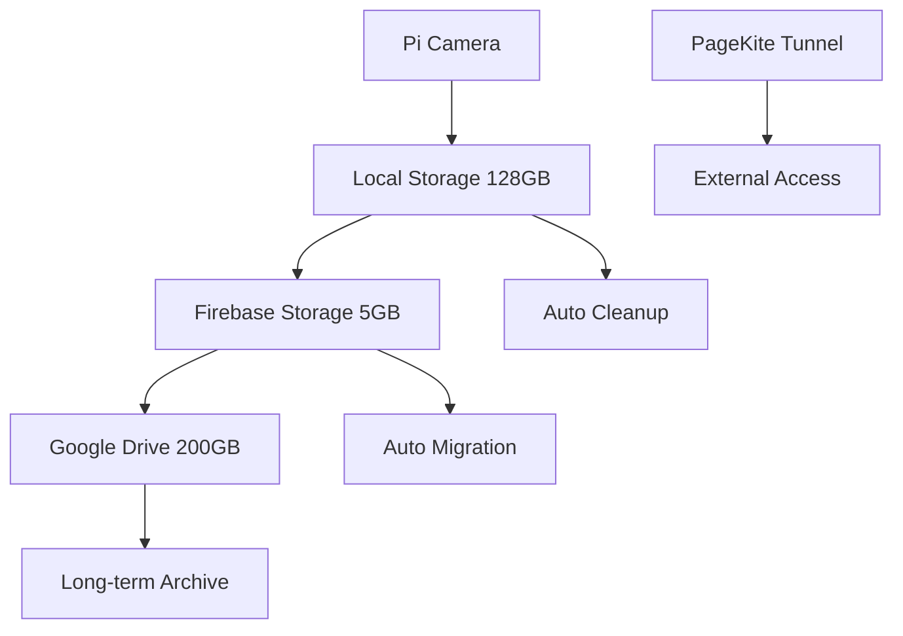

# 🚀 Smart Hybrid Storage + PageKite System

## ภาพรวมระบบ / System Overview

ระบบจัดการข้อมูลแบบ Hybrid สำหรับ Fish Feeder IoT ที่รวม Local Storage, Firebase, Google Drive และ PageKite เข้าด้วยกัน

**Smart Hybrid Storage System for Fish Feeder IoT combining Local Storage, Firebase, Google Drive, and PageKite.**

### 🏗️ สถาปัตยกรรม / Architecture



### 💾 ขั้นตอนการจัดเก็บ / Storage Flow

1. **บันทึกวีดีโอ / Video Recording**: บันทึกลงใน Local Pi Storage (128GB)
2. **อัปโหลดทันที / Immediate Upload**: ส่งไปยัง Firebase Storage (5GB) ทันทีหลังบันทึก
3. **ย้ายข้อมูล / Auto Migration**: หลัง 24 ชั่วโมง ย้ายจาก Firebase → Google Drive (200GB)
4. **ลบข้อมูลเก่า / Cleanup**: ลบไฟล์เก่าจาก Local Storage หลัง 7 วัน

### 🌐 การเข้าถึงจากภายนอก / External Access

- **PageKite Tunnel**: เข้าถึงระบบจากอินเทอร์เน็ตผ่าน HTTPS
- **ประหยัดค่าใช้จ่าย**: PageKite มี trial 2GB/month ฟรี

---

## 🛠️ การติดตั้ง / Installation

### 1. ติดตั้งอัตโนมัติ / Automatic Setup

```bash
cd /path/to/pi-mqtt-server
python3 setup_hybrid_storage.py
```

### 2. ติดตั้งแบบปกติ / Manual Setup

```bash
# ติดตั้ง dependencies
pip3 install -r requirements_enhanced.txt

# สร้างโฟลเดอร์
sudo mkdir -p /home/pi/fish_feeder_data/{videos,photos,temp,processing,logs}
sudo chown -R pi:pi /home/pi/fish_feeder_data
```

---

## ⚙️ การตั้งค่า / Configuration

### 🔥 Firebase Storage

1. ไฟล์ `serviceAccountKey.json` ต้องอยู่ในโฟลเดอร์เดียวกับ `main.py`
2. Firebase Storage จะถูกใช้อัตโนมัติ

### 🗂️ Google Drive Setup

1. ไปที่ [Google Cloud Console](https://console.cloud.google.com/)
2. สร้างโปรเจคใหม่หรือเลือกโปรเจคที่มี
3. เปิดใช้งาน Google Drive API
4. สร้าง Credentials (Desktop application)
5. ดาวน์โหลดไฟล์ JSON และเปลี่ยนชื่อเป็น `google_drive_credentials.json`
6. วางไฟล์ในโฟลเดอร์เดียวกับ `main.py`

```bash
# ทดสอบการเชื่อมต่อ Google Drive
python3 -c "from smart_hybrid_storage import SmartHybridStorage; s=SmartHybridStorage()"
```

### 🌐 PageKite Setup

1. สมัครสมาชิก [PageKite](https://pagekite.net/) (ฟรี 2GB/month)
2. เลือก subdomain ที่ต้องการ
3. ตั้งค่าใน `storage_config.json`:

```json
{
  "pagekite": {
    "enabled": true,
    "subdomain": "your-subdomain",
    "backend_port": 5000,
    "auto_start": false
  }
}
```

---

## 🎮 การใช้งาน / Usage

### เริ่มต้นระบบ / Start System

```bash
python3 main.py
```

### การควบคุมผ่าน API / API Control

#### 📹 Video Recording

```bash
# เริ่มบันทึก
curl -X POST http://localhost:5000/api/camera/record/start \
  -H "Content-Type: application/json" \
  -d '{"session_id": "feed_001"}'

# หยุดบันทึก
curl -X POST http://localhost:5000/api/camera/record/stop
```

#### 🌐 PageKite Control

```bash
# เปิด PageKite
curl -X POST http://localhost:5000/api/pagekite/start

# ปิด PageKite  
curl -X POST http://localhost:5000/api/pagekite/stop

# ตรวจสอบสถานะ
curl http://localhost:5000/api/pagekite/status
```

#### 💾 Storage Management

```bash
# ตรวจสอบพื้นที่จัดเก็บ
curl http://localhost:5000/api/storage/status

# เริ่ม migration แบบปรับมือ
curl -X POST http://localhost:5000/api/storage/migrate
```

---

## 📊 การติดตามระบบ / System Monitoring

### พื้นที่จัดเก็บ / Storage Usage

```bash
# ตรวจสอบพื้นที่ Pi
df -h /home/pi/fish_feeder_data

# ตรวจสอบผ่าน API
curl http://localhost:5000/api/storage/status
```

### ไฟล์ Log / Log Files

- **ระบบหลัก**: `logs/system.log`
- **เซ็นเซอร์**: `logs/YYYY-MM-DD/sensor_log.txt`
- **ไฟล์ข้อมูล**: `/home/pi/fish_feeder_data/file_records.json`

---

## 🔧 การแก้ไขปัญหา / Troubleshooting

### ปัญหาที่พบบ่อย / Common Issues

#### Camera ไม่ทำงาน / Camera Not Working

```bash
# ตรวจสอบ camera
ls /dev/video*

# ทดสอบ camera
python3 -c "import cv2; cap=cv2.VideoCapture(0); print('Camera working' if cap.isOpened() else 'Camera failed')"
```

#### Google Drive ไม่เชื่อมต่อ / Google Drive Connection Failed

```bash
# ลบ token และลองใหม่
rm google_drive_token.json
python3 -c "from smart_hybrid_storage import SmartHybridStorage; s=SmartHybridStorage()"
```

#### PageKite ไม่ทำงาน / PageKite Not Working

```bash
# ติดตั้ง PageKite
pip3 install pagekite

# ทดสอบ
pagekite.py --help
```

#### พื้นที่เต็ม / Storage Full

```bash
# ลบไฟล์เก่า
find /home/pi/fish_feeder_data/videos -name "*.mp4" -mtime +7 -delete

# ทำ migration แบบปรับมือ
curl -X POST http://localhost:5000/api/storage/migrate
```

---

## 🚀 การใช้งานกับ systemd / systemd Integration

### เปิดใช้งาน auto-start / Enable Auto-start

```bash
sudo systemctl enable fish-feeder
sudo systemctl start fish-feeder
```

### ตรวจสอบสถานะ / Check Status

```bash
sudo systemctl status fish-feeder
```

### ดู logs / View Logs

```bash
sudo journalctl -u fish-feeder -f
```

---

## 📈 สถิติการใช้งาน / Usage Statistics

### การใช้ข้อมูล / Data Usage

- **การให้อาหาร 1 ครั้ง**: ~50MB วีดีโอ (2-3 นาที)
- **การใช้งานต่อวัน**: ~150MB (3 ครั้งต่อวัน)
- **การใช้งานต่อเดือน**: ~4.5GB

### ความจุจัดเก็บ / Storage Capacity

- **Local Pi**: 128GB (~2,500 วีดีโอ)
- **Firebase**: 5GB (~100 วีดีโอ)
- **Google Drive**: 200GB (~4,000 วีดีโอ)
- **รวม**: ~6,600 วีดีโอ

---

## 🔒 ความปลอดภัย / Security

### การเข้าถึง / Access Control

- **Local**: เฉพาะ network เดียวกัน
- **PageKite**: HTTPS encryption
- **Firebase**: Google authentication
- **Google Drive**: OAuth 2.0

### การสำรองข้อมูล / Backup

- **Triple redundancy**: Local + Firebase + Google Drive
- **Auto-migration**: ป้องกันการสูญหายข้อมูล
- **Cleanup scheduling**: จัดการพื้นที่อัตโนมัติ

---

## 🌟 คุณสมบัติขั้นสูง / Advanced Features

### การจัดการข้อมูลอัตโนมัติ / Auto Data Management

```python
# ตั้งค่า migration schedule
{
  "migration": {
    "enabled": true,
    "schedule_hour": 2,        # ทำงานเวลา 2:00 AM
    "min_age_hours": 24,       # ย้ายไฟล์อายุ 24 ชั่วโมง
    "batch_size": 10           # ย้าย 10 ไฟล์ต่อครั้ง
  }
}
```

### การตั้งค่าวีดีโอ / Video Settings

```python
{
  "video_settings": {
    "resolution": [640, 480],
    "fps": 12,
    "quality": 40,
    "max_duration_seconds": 300,
    "auto_stop_after_feeding": true
  }
}
```

---

## 📞 การสนับสนุน / Support

### ข้อมูลเพิ่มเติม / Additional Information

- **Web App**: https://fish-feeder-test-1.web.app
- **Firebase Console**: https://console.firebase.google.com/
- **Google Drive API**: https://console.cloud.google.com/
- **PageKite**: https://pagekite.net/

### การพัฒนาต่อ / Further Development

- เพิ่มการสนับสนุน OneDrive (1TB)
- ระบบ AI สำหรับการวิเคราะห์วีดีโอ
- Mobile app สำหรับการควบคุม
- ระบบแจ้งเตือนแบบ real-time

---

**🎯 Smart Hybrid Storage = Local Speed + Cloud Reliability + Cost Efficiency** 