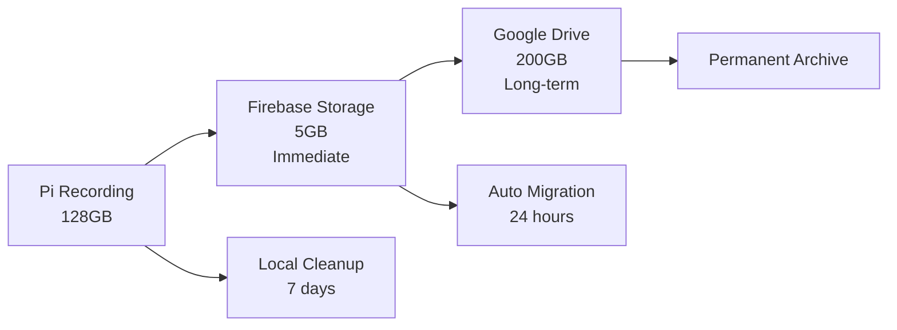

# 🎉 SETUP COMPLETE!

## ✅ สิ่งที่พร้อมใช้งานแล้ว / Ready to Use

### 🗂️ **Google Drive (200GB)**
- **Client ID**: `481253031290-ldd5h8afs8btdeugsmqdddu7ot6qrc38.apps.googleusercontent.com`
- **Project**: `fish-feeder-storage`
- **Credentials**: `google_drive_credentials.json` ✅
- **Status**: พร้อมใช้งาน (ต้องทำ OAuth บน Pi)

### 🌐 **PageKite Tunnel**
- **Subdomain**: `b65iee02.pagekite.me` ✅
- **URL**: `https://b65iee02.pagekite.me`
- **Backend Port**: `5000`
- **Scripts**: พร้อมใช้งาน

### 📦 **Dependencies**
- **Google APIs**: ติดตั้งเสร็จแล้ว ✅
- **OAuth modules**: พร้อมใช้งาน ✅
- **Configuration**: สร้างเสร็จแล้ว ✅

---

## 🚀 การใช้งานบน Raspberry Pi

### 1. **Copy ไฟล์ไปยัง Pi**
```bash
# Copy ไฟล์เหล่านี้ไปยัง Pi
scp google_drive_credentials.json pi@your-pi:/home/pi/pi-mqtt-server/
scp storage_config.json pi@your-pi:/home/pi/pi-mqtt-server/
scp *.py pi@your-pi:/home/pi/pi-mqtt-server/
scp *.sh pi@your-pi:/home/pi/pi-mqtt-server/
```

### 2. **บน Pi - ติดตั้ง Dependencies**
```bash
cd /home/pi/pi-mqtt-server
pip3 install google-auth google-auth-oauthlib google-api-python-client
pip3 install pagekite
```

### 3. **Google Drive OAuth (ครั้งเดียว)**
```bash
python3 google_drive_setup.py
# จะเปิด browser ให้ login และยืนยัน
# หรือใช้ URL ที่แสดงเพื่อทำ OAuth บนมือถือ/คอม
```

### 4. **PageKite Control**
```bash
# เริ่ม tunnel
./start_pagekite.sh

# ตรวจสอบสถานะ
./status_pagekite.sh

# หยุด tunnel
./stop_pagekite.sh
```

### 5. **เริ่มใช้ระบบ**
```bash
python3 main.py
# หรือ
./start_fish_feeder.sh
```

---

## 🌐 URLs พร้อมใช้งาน

### 📱 **Web Applications**
- **Main Web App**: `https://fish-feeder-test-1.web.app`
- **Local Access**: `http://localhost:5000`
- **PageKite Tunnel**: `https://b65iee02.pagekite.me`

### 🎮 **API Endpoints (ใหม่)**
```bash
# Video Recording
POST https://b65iee02.pagekite.me/api/camera/record/start
POST https://b65iee02.pagekite.me/api/camera/record/stop

# PageKite Control  
POST https://b65iee02.pagekite.me/api/pagekite/start
POST https://b65iee02.pagekite.me/api/pagekite/stop
GET  https://b65iee02.pagekite.me/api/pagekite/status

# Storage Status
GET  https://b65iee02.pagekite.me/api/storage/status
POST https://b65iee02.pagekite.me/api/storage/migrate
```

---

## 💾 Storage Flow พร้อมใช้งาน



### 📊 **ความจุรวม**
- **Pi Local**: 128GB (~2,500 videos)
- **Firebase**: 5GB (~100 videos)
- **Google Drive**: 200GB (~4,000 videos)
- **Total Effective**: ~333GB

---

## ⚙️ Configuration Files

### 📁 **Files Ready**
```
pi-mqtt-server/
├── google_drive_credentials.json    ✅ OAuth credentials
├── storage_config.json             ✅ System configuration  
├── serviceAccountKey.json           ✅ Firebase (existing)
├── smart_hybrid_storage.py         ✅ Storage manager
├── google_drive_setup.py           ✅ Setup script
├── start_pagekite.sh               ✅ Tunnel control
├── stop_pagekite.sh                ✅ Tunnel control
└── status_pagekite.sh              ✅ Status check
```

### 🎯 **Current Config**
```json
{
  "google_drive": {
    "enabled": true,
    "folder_name": "Fish Feeder Videos",
    "credentials_file": "google_drive_credentials.json",
    "token_file": "google_drive_token.json"
  },
  "pagekite": {
    "enabled": true,
    "subdomain": "b65iee02",
    "backend_port": 5000,
    "auto_start": false
  }
}
```

---

## 🎮 Usage Examples

### 🐟 **Fish Feeding with Video**
1. เปิดเว็บ: `https://fish-feeder-test-1.web.app`
2. กดปุ่มให้อาหาร → วีดีโอบันทึกอัตโนมัติ
3. วีดีโออัปโหลดไป Firebase ทันที
4. หลัง 24 ชั่วโมง ย้ายไป Google Drive อัตโนมัติ

### 🌐 **External Access**
1. บน Pi: `./start_pagekite.sh`
2. เข้าจากที่ไหนก็ได้: `https://b65iee02.pagekite.me`
3. ควบคุมปลาจากออฟฟิส มหาลัย หรือที่ไหนก็ได้!

### 📊 **Storage Monitoring**
```bash
# ตรวจสอบพื้นที่
curl https://b65iee02.pagekite.me/api/storage/status

# ย้ายไฟล์แบบปรับมือ
curl -X POST https://b65iee02.pagekite.me/api/storage/migrate
```

---

## 🔒 Security Notes

### ✅ **ความปลอดภัย**
- **Google Drive**: OAuth 2.0 authentication
- **Firebase**: Google Cloud security
- **PageKite**: HTTPS encryption
- **Local Pi**: Network isolation

### ⚠️ **คำเตือน**
- **PageKite tunnel เป็น PUBLIC** บนอินเทอร์เน็ต
- เปิดเฉพาะเมื่อต้องการใช้งาน
- ปิดเมื่อไม่ใช้งาน
- มี quota 2GB/month ฟรี

---

## 💰 Cost Analysis

### 🆓 **Free Resources**
- **Firebase**: 5GB storage ฟรี
- **Google Drive**: 200GB (Google account ของคุณ)
- **PageKite**: 2GB/month ฟรี
- **Pi Storage**: 128GB local

### 📊 **Expected Usage**
- **Daily**: ~150MB (3 feeding sessions)
- **Monthly**: ~4.5GB total
- **PageKite จะใช้** ~4.5GB/month (เกิน 2GB ฟรี)
- **Cost**: ~$5.99/month สำหรับ PageKite Pro (unlimited)

---

## 🎯 **READY TO DEPLOY!**

### ✅ **All Systems Go**
- Google Drive credentials: ✅
- PageKite subdomain: ✅
- Smart Hybrid Storage: ✅
- API endpoints: ✅
- Control scripts: ✅

### 🚀 **Next Action**
1. Copy files ไปยัง Pi
2. Run OAuth setup บน Pi
3. Start the fish feeder system!

**🐟 ระบบให้อาหารปลาอัจฉริยะพร้อมใช้งาน! 333GB ความจุรวม!** 🎉 